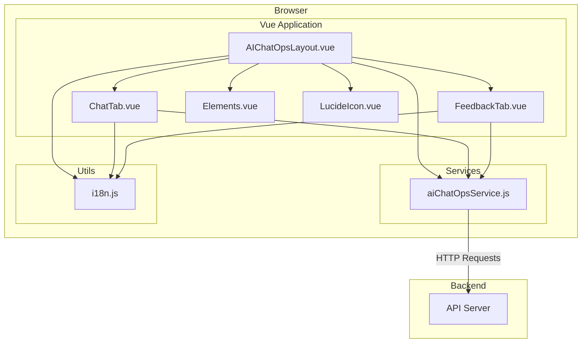

# AIChatOps 상세 설계 문서 (수정본)

## 1. 개요

이 문서는 AIChatOps 프론트엔드 애플리케이션의 아키텍처, 컴포넌트별 상세 설계, 핵심 데이터 흐름, 그리고 UI/UX 전략을 상세히 기술합니다. 시스템의 현재 구현 상태를 정확히 반영하고, 향후 유지보수 및 기능 확장의 기술적 기반을 제공하는 것을 목표로 합니다.

## 2. 시스템 아키텍처

AIChatOps는 Vue.js 2 기반의 단일 페이지 애플리케이션(SPA)으로, 다음과 같은 계층적 아키텍처를 따릅니다.

- **컴포넌트 계층**: `AIChatOpsLayout.vue`를 최상위 컴포넌트로 하여 UI를 구성합니다. 재사용 가능한 UI 요소는 `Elements.vue`와 `LucideIcon.vue`로 분리되었습니다.
- **서비스 계층**: `aiChatOpsService.js`가 모든 백엔드 API 통신을 중앙에서 처리하여 컴포넌트와 API 호출 로직을 분리합니다.
- **유틸리티 계층**: `i18n.js`가 다국어 텍스트 리소스를 관리합니다.

## 3. 데이터 흐름 및 상태 관리

### 3.1. 데이터 흐름 (Unidirectional Data Flow)

- **하향식 (Props)**: `AIChatOpsLayout`이 `selectedPersona`와 같은 핵심 상태를 자식 컴포넌트(`ChatTab`)에 Props로 전달합니다.
- **상향식 (Events)**: `ChatTab`은 사용자 액션이 발생하면 `$emit`을 통해 부모에게 이벤트를 보내고, `AIChatOpsLayout`이 상태 변경을 처리합니다.

### 3.2. 상태 관리

- **지역 상태**: 각 컴포넌트는 자신의 UI 상태를 내부 `data` 속성으로 관리합니다.
- **공유 상태**: 애플리케이션 전반의 공유 상태(예: `selectedPersona`, `currentView`)는 최상위 컴포넌트 `AIChatOpsLayout`이 소유하고 관리합니다. (Orchestrator Pattern)
- **캐시**: 페르소나별 대화 기록은 `AIChatOpsLayout`의 `personaMessageCache` (Map 객체)에 저장되어, API 호출을 최소화하고 빠른 화면 전환을 지원합니다.

## 4. 컴포넌트 상세 설계

### 4.1. `AIChatOpsLayout.vue`

- **역할**: 전체 UI 레이아웃과 애플리케이션의 핵심 상태를 총괄하는 컨테이너 컴포넌트입니다.
- **상태 (data)**: `isOpen`, `isInitialized`, `currentView`, `selectedPersona`, `personas`, `loadingPersonas`, `isConnected`, `currentLanguage`, `currentTheme`, `personaMessageCache`, `pendingRequests`.
- **핵심 로직**:
    - **뷰 전환**: `currentView` 상태를 변경하여 카테고리 선택, 페르소나 목록, 채팅, 피드백 화면 간의 전환을 제어합니다.
    - **이벤트 핸들링**: `handleMessageSent`, `handleFeedbackSent` 메소드를 통해 자식 컴포넌트의 이벤트를 받아 서비스 호출을 트리거합니다.
    - **캐시 관리**: `saveCurrentMessages`, `loadCachedMessages`, `preloadPopularPersonas`, `cleanupCache` 메소드를 통해 메시지 캐시를 관리하여 성능을 최적화합니다.

### 4.2. `ChatTab.vue`

- **역할**: 사용자와 AI 간의 실제 상호작용이 이루어지는 채팅 인터페이스입니다.
- **Props**: `selectedPersona`, `isProcessing`, `currentLanguage` 등 부모로부터 핵심 상태를 전달받습니다.
- **상태 (data)**: `messages`, `currentMessage`, `loadingHistory`, `quickQuestions`, `continuousChatEnabled`.
- **핵심 로직**:
    - **메시지 렌더링**: `messages` 배열을 `v-for`로 순회하며 `Elements.vue` 컴포넌트를 통해 메시지를 렌더링합니다. AI 응답 대기 시 로딩 애니메이션을 표시합니다.
    - **사용자 입력 처리**: `sendMessage` 메소드가 사용자 입력을 받아 부모에게 `message-sent` 이벤트를 발생시킵니다.
    - **고급 기능**: `generateQuickQuestions` (AI 질문 추천), `toggleContinuousChat` (문맥 유지 대화) 기능을 제공합니다.
    - **성능 최적화**: `scheduleBatchUpdate`와 `processBatchMessages` 메소드를 통해 여러 메시지를 배치로 처리하여 한 번에 DOM에 추가함으로써 렌더링 부하를 줄입니다.

### 4.3. `aiChatOpsService.js`

- **역할**: 모든 백엔드 API 통신을 추상화한 서비스 모듈입니다.
- **API 목록**:
    - `healthCheck()`: 서버 상태를 확인합니다.
    - `getPersonas()`: 모든 페르소나 목록을 가져옵니다.
    - `getConversations(personaCode)`: 특정 페르소나의 대화 기록을 가져옵니다.
    - `sendMessage(messageData)`: 사용자 메시지를 보내고 AI 응답을 받습니다.
    - `generateQuickQuestions(questionData)`: AI에게 빠른 질문 생성을 요청합니다.
    - `sendFeedback(feedbackData)`: 사용자 피드백을 제출합니다.
- **에러 처리**: `getErrorMessage` 함수를 통해 HTTP 상태 코드, 네트워크 오류 등을 일관된 형식의 에러 메시지로 변환하여 반환합니다.
- **데이터 파싱**: `parseQuickQuestions` 함수가 백엔드에서 받은 다양한 형태의 빠른 질문 데이터를 표준화된 배열 형태로 파싱합니다.

## 5. UI/UX 및 성능 최적화

- **UI 업데이트 최적화**: `Object.assign`을 사용한 상태 일괄 업데이트와 `$nextTick`을 활용한 DOM 업데이트 스케줄링으로 불필요한 리렌더링을 방지합니다.
- **GPU 가속**: `transform`, `will-change` 등의 CSS 속성을 사용하여 애니메이션이 적용되는 요소의 렌더링 성능을 최적화합니다.
- **향상된 입력창**: `textarea`의 높이가 내용에 따라 자동으로 조절되며, 최대 높이에 도달하면 스크롤이 활성화되는 등 사용자 편의성을 높였습니다.
- **시각적 피드백**: 로딩 상태, 버튼 활성/비활성 상태, 오류 상태 등을 명확한 시각적 요소로 사용자에게 전달합니다.

## 6. 식별된 문제점 및 향후 개선 방향

- **메시지 전송 데이터 불일치 (치명적)**: `ChatTab.vue`에서 `sendMessage` 호출 시 `userQuery` 필드명을 사용하나, 서비스에서는 `userQuestion`을 기대하여 메시지가 전송되지 않는 버그가 있습니다. **`ChatTab.vue`에서 필드명을 `userQuestion`으로 즉시 수정해야 합니다.**
- **상태 관리 복잡도**: `AIChatOpsLayout`에 집중된 상태 관리 로직을 Vuex, Pinia 또는 Vue 3의 Composable과 같은 전문 상태 관리 패턴으로 분리하여 유지보수성을 향상시킬 필요가 있습니다.
- **컴포넌트 결합도**: `$refs`를 통한 자식 메소드 직접 호출 대신, 중앙 상태 관리나 더 엄격한 Props/Emit 패턴을 사용하여 컴포넌트 간의 결합도를 낮춰야 합니다.
- **가상 스크롤**: 대화 내용이 매우 길어질 경우를 대비하여, `vue-virtual-scroller`와 같은 가상 스크롤 라이브러리를 도입하여 렌더링 성능을 보장하는 것을 고려해야 합니다.
