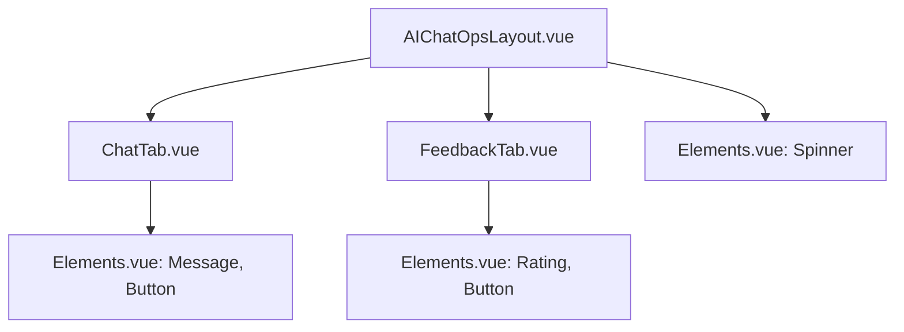

# AIChatOps 상세 설계 문서

## 1. 개요

AIChatOps는 사용자 맞춤형 AI 채팅 서비스를 제공하는 웹 애플리케이션입니다. 사용자는 다양한 전문 분야(페르소나)를 선택하여 해당 분야에 특화된 AI와 대화할 수 있습니다. 이 문서는 AIChatOps의 사용자 관점에서의 기능, 인터페이스, 상호작용 및 기술적 설계를 상세히 기술합니다.

## 2. 시스템 아키텍처

AIChatOps는 Vue.js 기반의 프론트엔드 애플리케이션으로, 단일 페이지 애플리케이션(SPA) 형태로 구성됩니다. 주요 아키텍처는 다음과 같습니다.

- **프레임워크**: Vue.js
- **상태 관리**: Vue 컴포넌트 내부 데이터 및 props
- **API 통신**: `axios` 라이브러리를 사용한 비동기 HTTP 요청
- **UI/UX**: 동적 테마, 다국어 지원, 반응형 디자인

### 2.1. 컴포넌트 구조

- **`AIChatOpsLayout.vue`**: 전체 UI의 레이아웃과 상태를 관리하는 최상위 컴포넌트입니다. 채팅 창의 열고 닫힘, 테마 변경, 언어 변경, 페르소나 선택 등의 기능을 담당합니다.
- **`ChatTab.vue`**: 실제 채팅이 이루어지는 컴포넌트입니다. 메시지 전송, 대화 기록 표시, 빠른 질문, 연속 대화 등의 기능을 제공합니다.
- **`FeedbackTab.vue`**: 사용자가 서비스에 대한 피드백을 제출하는 컴포넌트입니다. 별점 평가와 텍스트 의견을 입력받습니다.
- **`Elements.vue`**: 버튼, 스피너, 별점, 메시지 버블 등 재사용 가능한 UI 요소를 모아놓은 컴포넌트입니다.

### 2.2. 서비스 및 유틸리티

- **`aiChatOpsService.js`**: 백엔드 API와의 모든 통신을 담당하는 서비스 모듈입니다. 페르소나 목록 조회, 메시지 전송, 대화 기록 관리 등의 API를 호출합니다.
- **`i18n.js`**: 다국어 지원을 위한 텍스트 리소스를 관리하는 유틸리티입니다. 한국어(ko)와 영어(en)를 지원합니다.

## 3. 사용자 인터페이스 및 경험 (UI/UX)

### 3.1. 메인 화면 (`AIChatOpsLayout.vue`)

#### 3.1.1. 채팅 플로팅 버튼

- **기능**: 채팅 창을 열고 닫는 토글 버튼입니다.
- **상태**:
    - **기본**: 파란색 그라데이션 배경의 아이콘.
    - **활성화 (채팅 창 열림)**: 청록색 그라데이션 배경의 'X' 아이콘으로 변경.
    - **로딩 중**: 스피너 표시.

#### 3.1.2. 채팅 창

- **기능**: 채팅 인터페이스 전체를 담는 컨테이너입니다.
- **상태**:
    - **기본**: 화면 우측 하단에 위치.
    - **최소화**: 헤더만 남기고 접힌 상태.
    - **최대화**: 더 큰 크기로 확장된 상태.
- **최적화**: `v-if` 대신 `v-show`를 사용하여 채팅 창의 DOM을 유지하고 표시 여부만 토글함으로써, 초기화 비용을 줄이고 렌더링 성능을 향상시켰습니다.

#### 3.1.3. 헤더

- **기능**: 챗봇 정보, 테마/언어 변경, 창 제어 기능을 제공합니다.
- **구성**:
    - **봇 정보**: 봇 아바타, 이름, 온라인/오프라인 상태 표시.
    - **테마 변경**: 5가지 테마(Default, Timeless, Heritage, Modern, Hermes)를 순환하며 변경.
    - **언어 변경**: 한국어/영어를 토글.
    - **창 제어**: 최소화, 최대화, 닫기 버튼.

### 3.2. 카테고리 및 페르소나 선택

- **기능**: 사용자가 대화할 AI의 전문 분야를 선택하는 단계입니다.
- **흐름**:
    1. **카테고리 선택**: '개인 특화', '일반 문의', '운영/관리' 중 하나를 선택합니다.
    2. **페르소나 선택**: 선택된 카테고리에 속한 페르소나 목록이 표시됩니다. 각 페르소나는 고유한 아이콘, 제목, 설명을 가집니다.
- **최적화**: `v-if` 대신 `v-show`를 사용하여 화면 전환 시 컴포넌트를 재생성하지 않고 표시 여부만 변경하여 성능을 개선했습니다.

### 3.3. 채팅 화면 (`ChatTab.vue`)

#### 3.3.1. 대화 영역

- **기능**: 사용자와 AI의 대화 내용이 표시됩니다.
- **구성**:
    - **시작 화면**: 페르소나 선택 시 환영 메시지와 설명, 팁을 표시합니다.
    - **메시지 버블**: 사용자 메시지는 오른쪽에, AI 메시지는 왼쪽에 정렬됩니다.
    - **로딩 표시**: AI가 응답을 생성하는 동안 재미있는 로딩 메시지와 함께 애니메이션이 표시됩니다.
- **최적화**:
    - **메시지 렌더링**: `requestAnimationFrame`을 활용하여 여러 메시지를 배치(batch)로 렌더링함으로써, 한 번에 많은 메시지가 추가될 때 발생하는 렌더링 부하를 줄였습니다.
    - **부드러운 스크롤**: `scroll-behavior: smooth` CSS 속성을 사용하여 새 메시지 추가 시 부드럽게 스크롤됩니다.

#### 3.3.2. 입력 영역

- **기능**: 사용자가 메시지를 입력하고 전송하는 영역입니다.
- **구성**:
    - **텍스트 입력창**: 여러 줄 입력이 가능하며, 내용에 따라 높이가 자동으로 조절됩니다.
    - **전송 버튼**: 메시지 입력 시 활성화되며, 로딩 중에는 스피너로 변경됩니다.
    - **부가 기능**:
        - **빠른 질문**: 페르소나별로 미리 정의된 질문을 선택하여 전송할 수 있습니다.
        - **연속 대화**: 이전 대화 내용을 포함하여 질문함으로써, 문맥을 유지하는 대화가 가능합니다.
        - **질문 생성**: AI에게 현재 상황에 맞는 질문을 생성하도록 요청할 수 있습니다.

### 3.4. 피드백 화면 (`FeedbackTab.vue`)

- **기능**: 사용자가 서비스 만족도와 의견을 제출하는 폼입니다.
- **구성**:
    - **별점 평가**: 1점에서 5점까지 만족도를 선택합니다.
    - **의견 입력**: 1000자 이내로 자유롭게 의견을 작성합니다.
    - **제출**: 입력 내용이 유효할 때 활성화되며, 제출 후 성공/실패 메시지를 표시합니다.

## 4. 핵심 기능 및 기술적 구현

### 4.1. 상태 관리 및 최적화

- **상태 변경 배치 처리**: `toggleChat`, `closeChat` 등 여러 상태를 한 번에 변경해야 하는 경우, `Object.assign`을 사용하여 상태를 일괄 업데이트하고 `$nextTick`으로 DOM 업데이트를 한 번만 수행하여 불필요한 리플로우/리페인트를 최소화했습니다. 이는 UI의 깜빡임(flickering) 현상을 방지하고 반응성을 높입니다.
- **`v-if` vs `v-show`**: 자주 토글되지만 내부 상태가 유지되어야 하는 컴포넌트(예: 카테고리 선택, 페르소나 목록)에는 `v-show`를 사용하여 초기 렌더링 비용을 줄였습니다. 반면, 메모리 사용량이 크고 자주 사용되지 않는 컴포넌트(예: `ChatTab`, `FeedbackTab`)에는 `v-if`를 사용하여 조건부 렌더링의 이점을 활용했습니다.

### 4.2. 비동기 통신 및 에러 처리 (`aiChatOpsService.js`)

- **API 추상화**: `axios`를 사용하여 모든 API 요청을 중앙에서 관리합니다. 각 API 호출은 `try...catch` 블록으로 감싸져 있으며, 성공/실패 여부와 데이터를 포함하는 일관된 형식의 객체를 반환합니다.
- **타임아웃**: 각 API 요청에 적절한 타임아웃(10초 ~ 60초)을 설정하여, 네트워크 지연 시 무한정 대기하는 것을 방지합니다.
- **에러 메시지**: `getErrorMessage` 유틸리티 함수를 통해 네트워크 에러, 서버 에러 등 다양한 종류의 오류에 대해 일관된 에러 메시지를 생성합니다.

### 4.3. 다국어 지원 (`i18n.js`)

- **구조**: 한국어와 영어 리소스를 `i18nResources` 객체에 정의하고, `getText` 함수를 통해 현재 언어 설정에 맞는 텍스트를 동적으로 가져옵니다.
- **동적 파라미터**: `getText('welcomeChat', { persona: '전문가' })`와 같이 파라미터를 전달하여 동적인 텍스트를 생성할 수 있습니다.

### 4.4. 캐싱 및 성능

- **메시지 캐시**: 페르소나별로 최근 30개의 메시지를 `personaMessageCache` (Map 객체)에 캐싱합니다. 사용자가 페르소나를 다시 선택했을 때, 캐시된 메시지를 먼저 로드하여 API 요청 없이 빠르게 대화 내용을 복원합니다.
- **캐시 정리**: `setInterval`을 사용하여 30초마다 캐시 크기를 확인하고, 10개를 초과하는 경우 가장 오래된 항목을 삭제하여 메모리 사용량을 관리합니다.
- **인기 페르소나 사전 로드**: 초기 로딩 시, 인기가 많은 페르소나 3개의 대화 기록을 미리 로드하여 사용자 경험을 향상시킵니다.

### 4.5. UI/UX 개선

- **GPU 가속**: `transform: translateZ(0)` 및 `will-change` CSS 속성을 사용하여 애니메이션이 적용되는 요소(`ai-chatops-chat-window`, `messages`)의 렌더링을 GPU에 위임함으로써, 애니메이션 성능을 최적화하고 깜빡임을 방지합니다.
- **강화된 입력창**: 사용자가 입력하는 텍스트의 양에 따라 텍스트 입력창의 높이가 최소 21px에서 최대 400px까지 자동으로 조절됩니다. 400px를 초과하면 스크롤바가 생성되어 긴 내용도 편리하게 입력할 수 있습니다.
- **시각적 피드백**: 입력창이 확장되거나 스크롤이 활성화될 때, 테두리 색상 변경 및 안내 메시지 표시 등 시각적 피드백을 제공하여 사용자에게 현재 상태를 명확하게 알려줍니다.

## 5. 결론

AIChatOps는 사용자 중심의 설계와 성능 최적화에 중점을 둔 AI 채팅 애플리케이션입니다. Vue.js의 반응성을 활용하고, 상태 관리 최적화, 비동기 처리, 캐싱 전략 등을 통해 빠르고 안정적인 사용자 경험을 제공합니다. 또한, 동적 테마, 다국어 지원, 세련된 UI 요소를 통해 사용자의 만족도를 높이고자 합니다. 이 설계 문서는 향후 기능 확장 및 유지보수의 기반이 될 것입니다.
