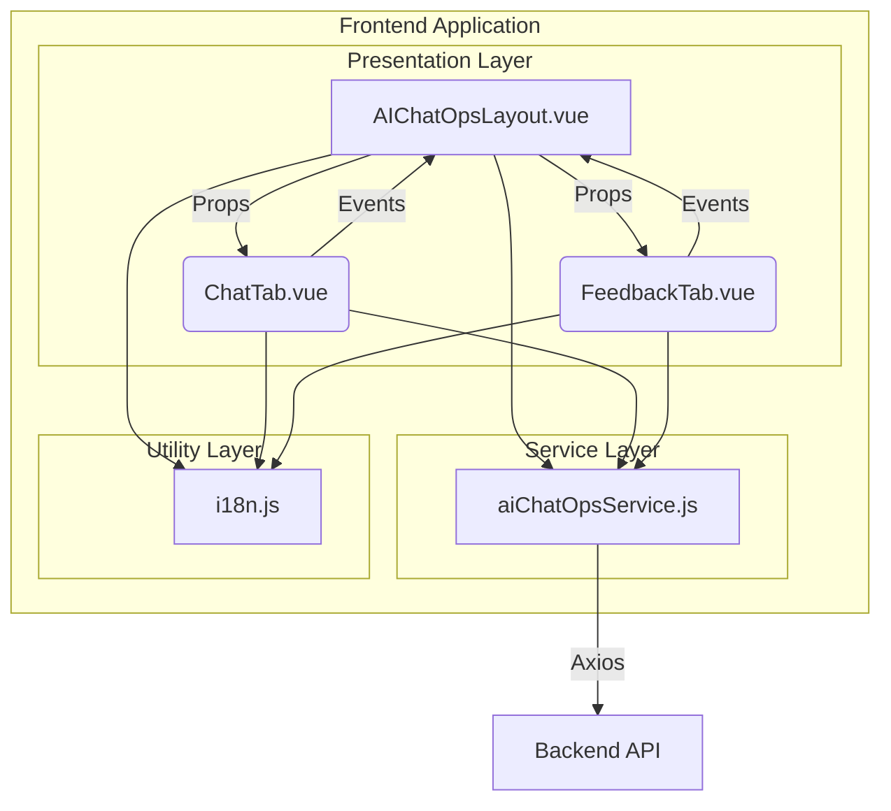
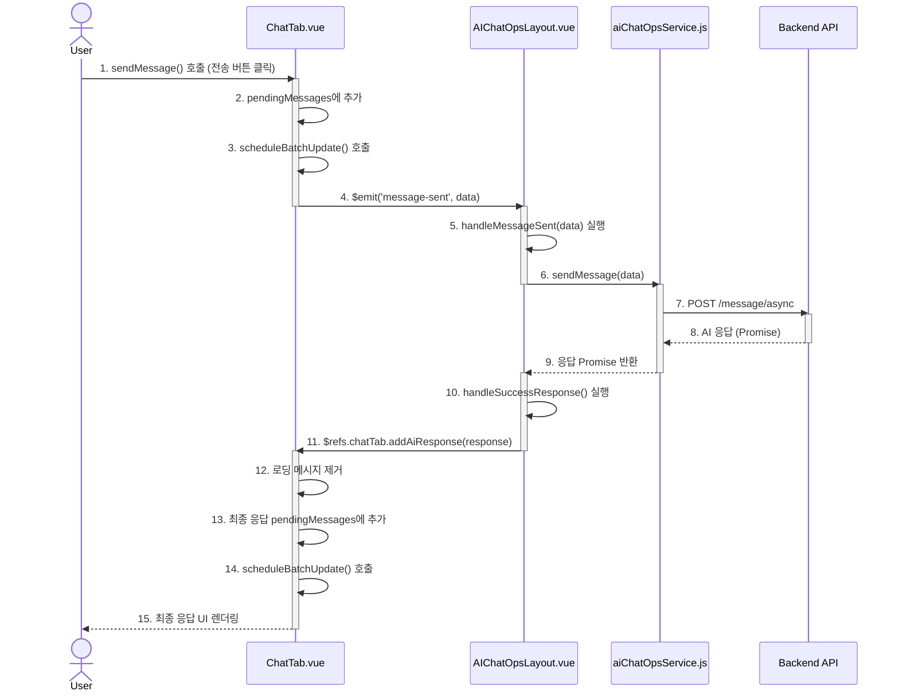

# AIChatOps 개발자 기술 설계 문서

## 1. 개요

이 문서는 AIChatOps 프론트엔드 애플리케이션의 아키텍처, 핵심 설계 원칙, 컴포넌트별 상세 구현, 그리고 주요 데이터 흐름을 기술하는 개발자용 기술 설계 문서입니다. 이 문서는 코드의 유지보수, 확장, 그리고 신규 개발자의 온보딩을 돕는 것을 목표로 합니다.

**기술 스택:**

-   **프레임워크**: Vue.js 2
-   **API 클라이언트**: Axios
-   **UI 아이콘**: Unicon (Vue-Unicon)
-   **스타일링**: CSS Variables, PostCSS (암시적)

## 2. 시스템 아키텍처

## 2. 시스템 아키텍처

AIChatOps는 단일 페이지 애플리케이션(SPA)으로, 다음과 같은 계층적 아키텍처를 가집니다.

-   **프레젠테이션 레이어 (Components)**: `AIChatOpsLayout.vue`를 루트로 하는 컴포넌트 트리 구조. UI 렌더링과 사용자 상호작용을 담당합니다.
-   **서비스 레이어 (Services)**: `aiChatOpsService.js`가 담당하며, 백엔드 API와의 모든 통신을 추상화하고 중앙에서 관리합니다.
-   **유틸리티 레이어 (Utils)**: `i18n.js`와 같이 애플리케이션 전반에서 사용되는 순수 함수 및 데이터 모듈을 포함합니다.

## 3. 핵심 설계 원칙 및 패턴

### 3.1. 중앙 집중식 상태 관리 (Orchestrator Pattern)

-   **설계**: 전역 상태 관리 라이브러리(Vuex 등) 대신, 최상위 컴포넌트인 `AIChatOpsLayout.vue`가 애플리케이션의 핵심 상태(현재 뷰, 선택된 페르소나, 테마, 언어 등)를 `data` 속성으로 소유하고 관리합니다.
-   **데이터 흐름**:
    -   **하향식 (Props)**: `AIChatOpsLayout`은 하위 컴포넌트(`ChatTab`, `FeedbackTab`)에 필요한 상태를 Props를 통해 전달합니다.
    -   **상향식 (Events)**: 하위 컴포넌트는 상태 변경이 필요할 때, 직접 상태를 수정하지 않고 `$emit`을 통해 부모에게 이벤트를 발생시킵니다. `AIChatOpsLayout`은 이 이벤트를 수신하여 상태를 변경하고, 변경된 상태는 다시 Props를 통해 하위로 전파됩니다.
-   **장점**: 소규모 애플리케이션에서 라이브러리 의존성을 줄이고, 데이터 흐름을 직관적으로 추적할 수 있습니다.

### 3.2. 성능 최적화 전략

-   **조건부 렌더링 (`v-if` vs `v-show`)**:
    -   `v-show`: 초기 렌더링 비용이 한 번만 발생하고, 이후에는 `display` 속성만 토글됩니다. `categorySelect`, `personaList`와 같이 자주 전환되지만 상태 유지가 필요한 화면에 사용하여 전환 속도를 높였습니다.
    -   `v-if`: 조건이 false일 때 컴포넌트를 완전히 파괴합니다. `ChatTab`, `FeedbackTab`과 같이 메모리 사용량이 상대적으로 크고, 한 번에 하나만 활성화되는 컴포넌트에 사용하여 비활성 시 메모리 점유를 줄였습니다.
-   **UI 업데이트 배치 처리 (Batch Update)**:
    -   **문제점**: 여러 상태를 순차적으로 변경하면 Vue의 반응성 시스템이 각 변경마다 리렌더링을 트리거하여 성능 저하 및 UI 깜빡임(flickering)을 유발할 수 있습니다.
    -   **해결책**: `Object.assign`을 사용하여 여러 `data` 속성을 한 번의 연산으로 묶어 업데이트하고, DOM 조작이 필요한 경우 `$nextTick`을 사용하여 모든 상태 변경이 완료된 후 한 번만 DOM을 업데이트하도록 스케줄링합니다.
-   **GPU 가속**: `transform: translateZ(0)`, `backface-visibility: hidden` 등의 CSS 속성을 사용하여 애니메이션이 적용되는 레이어를 GPU 렌더링 레이어로 승격시켜, 메인 스레드의 부담을 줄이고 애니메이션을 부드럽게 만듭니다.

### 3.3. 컴포넌트 재사용성

-   **`Elements.vue`**: 버튼, 스피너, 별점, 메시지 버블 등 애플리케이션 전반에서 사용되는 기초 UI 요소를 단일 컴포넌트로 통합했습니다. `componentType` Prop을 통해 렌더링할 요소를 동적으로 결정하여 코드 중복을 최소화하고 일관된 디자인 시스템을 유지합니다.

## 4. 컴포넌트 상세 분석

### 4.1. `AIChatOpsLayout.vue` (Orchestrator)

-   **역할**: 애플리케이션의 모든 것을 지휘하는 최상위 컴포넌트.
-   **주요 데이터 속성**:
    -   `isOpen`, `isInitialized`: 채팅창의 열림/초기화 상태.
    -   `currentView`: 현재 표시할 화면 (`categorySelect`, `personaList`, `chat`, `feedback`).
    -   `selectedCategory`, `selectedPersona`: 사용자가 선택한 카테고리와 페르소나 객체.
    -   `personas`: API로부터 받아온 전체 페르소나 목록.
    -   `personaMessageCache`: 페르소나별 대화 기록을 캐싱하는 `Map` 객체.
    -   `pendingRequests`: 처리 중인 비동기 요청을 추적하는 `Map` 객체.
-   **주요 메소드**:
    -   `toggleChat()`: 채팅창을 열고 닫으며, `v-show`와 `isInitialized` 상태를 제어하고, 페르소나 목록과 같은 초기 데이터를 비동기적으로 로드합니다.
    -   `selectPersona(persona)`: `selectedPersona` 상태를 업데이트하고 `currentView`를 'chat'으로 변경합니다.
    -   `handleMessageSent(data)`: `ChatTab`에서 발생한 `message-sent` 이벤트를 처리합니다. `aiChatOpsService.sendMessage`를 호출하고, 응답이 오면 `this.$refs.chatTab.addAiResponse`를 호출하여 `ChatTab`에 직접 응답을 전달합니다.
    -   `loadPersonas()`: 서비스 레이어를 통해 페르소나 목록을 비동기적으로 가져와 `personas` 데이터에 저장합니다.
    -   `saveCurrentMessages()` / `loadCachedMessages(personaCode)`: 페르소나 전환 시, 현재 대화 내용을 `personaMessageCache`에 저장하고, 전환된 페르소나의 캐시된 대화가 있다면 불러옵니다.

### 4.2. `ChatTab.vue` (Chat Interface)

-   **역할**: 실제 대화가 이루어지는 UI. 메시지 목록 관리, 사용자 입력 처리, 부가 기능(빠른 질문 등)을 담당.
-   **주요 Props**:
    -   `selectedPersona`: 현재 선택된 페르소나 정보. 이 객체를 기반으로 대화 기록을 로드하고 UI를 구성합니다.
    -   `isProcessing`: `AIChatOpsLayout`의 `pendingRequests` 크기에 따라 결정되며, true일 경우 입력창과 버튼을 비활성화합니다.
-   **주요 데이터 속성**:
    -   `messages`: 현재 채팅창에 표시되는 메시지 객체들의 배열.
    -   `currentMessage`: 사용자가 입력 중인 텍스트.
    -   `pendingMessages`: UI 렌더링 최적화를 위해 임시로 메시지를 담아두는 배열.
    -   `enhancedInputManager`: 입력창의 자동 높이 조절 로직을 위한 상태와 설정을 담은 객체.
-   **주요 메소드**:
    -   `sendMessage()`: 사용자 입력 전송의 시작점. 사용자 메시지와 로딩 메시지 객체를 생성하여 `pendingMessages`에 추가하고, `scheduleBatchUpdate()`를 호출한 뒤, 부모에게 `message-sent` 이벤트를 발생시킵니다.
    -   `addAiResponse(response)`: 부모 컴포넌트로부터 직접 호출되는 메소드. 로딩 메시지를 제거하고, 최종 AI 응답 메시지를 `pendingMessages`에 추가한 후 `scheduleBatchUpdate()`를 호출합니다.
    -   `scheduleBatchUpdate()` / `processBatchMessages()`: `pendingMessages`에 쌓인 메시지들을 `$nextTick`을 사용하여 한 번의 배치로 `messages` 배열에 추가하고, DOM 업데이트 후 스크롤을 조정합니다.
    -   `loadPersonaHistory()`: `selectedPersona` Prop이 변경될 때 호출되어, 서비스 레이어를 통해 해당 페르소나의 과거 대화 기록을 불러옵니다.
    -   `adjustTextareaHeight()`: `enhancedInputManager`의 설정에 따라 입력창의 높이와 스크롤 상태를 동적으로 조절합니다.

### 4.3. `aiChatOpsService.js` (Service Layer)

-   **역할**: 백엔드 API와의 통신을 위한 단일 진입점(Single Point of Entry).
-   **구현**: 각 메소드는 `axios`를 사용하여 비동기 요청을 보내고, `try...catch`로 예외를 처리합니다. 모든 메소드는 `{ success: boolean, data?: any, errorMessage?: string }` 형태의 일관된 응답 객체를 반환하도록 설계되었습니다.
-   **주요 메소드**:
    -   `getPersonas()`: 페르소나 목록을 조회합니다.
    -   `sendMessage(messageData, useAsync)`: 사용자 메시지를 서버에 전송합니다.
    -   `getConversations(personaCode)`: 특정 페르소나의 대화 기록을 조회합니다.
    -   `deleteConversations(personaCode)`: 대화 기록을 삭제합니다.
    -   `htmlToMarkdown(html)` / `htmlToPlainText(html)`: AI 응답으로 받은 HTML 콘텐츠를 복사 기능에 맞게 마크다운이나 순수 텍스트로 변환하는 유틸리티 함수.

## 5. 핵심 흐름 분석: 메시지 전송 메소드 호출 스택

## 5. 핵심 흐름 분석: 메시지 전송 메소드 호출 스택

사용자가 메시지를 입력하고 '전송' 버튼을 클릭했을 때의 전체 흐름은 다음과 같습니다.

1.  **[User Action]** 사용자가 `ChatTab.vue`의 전송 버튼(`@click="sendMessage"`)을 클릭합니다.

2.  **`ChatTab.vue` - `sendMessage()` 메소드 실행**
    -   `canSendMessage` computed 속성을 통해 전송 가능 여부 확인.
    -   사용자 메시지 객체(`userMessage`)와 AI 로딩 메시지 객체(`loadingMessage`)를 생성.
    -   두 객체를 `this.pendingMessages` 배열에 추가.
    -   `this.scheduleBatchUpdate()` 호출 → `$nextTick`으로 `processBatchMessages` 예약. (이 시점에 UI가 즉시 업데이트되어 사용자 메시지와 로딩 상태가 표시됨)
    -   `this.$emit('message-sent', { personaCode, userQuestion })`을 통해 부모에게 이벤트 발생.

3.  **`AIChatOpsLayout.vue` - `@message-sent="handleMessageSent"` 이벤트 리스너 실행**
    -   `handleMessageSent(data)` 메소드가 수신한 `data`와 함께 실행됨.
    -   `this.pendingRequests.set(...)`을 호출하여 요청 상태 추적 시작 (`isProcessing` 상태가 true로 변경됨).
    -   `aiChatOpsService.sendMessage(data, true)` 호출. (Promise 반환)

4.  **`aiChatOpsService.js` - `sendMessage()` 메소드 실행**
    -   `axios.post(...)`를 사용하여 백엔드 API(`/message/async`)에 비동기 POST 요청 전송.

5.  **[Async Wait]** 백엔드에서 AI 응답을 처리하는 동안 대기.

6.  **`AIChatOpsLayout.vue` - Promise `then()` 블록 실행**
    -   API 응답이 성공적으로 도착하면, `sendMessage` Promise의 `.then(response => ...)` 블록이 실행됨.
    -   `this.handleSuccessResponse(data, response)` 호출.

7.  **`AIChatOpsLayout.vue` - `handleSuccessResponse()` 메소드 실행**
    -   `this.pendingRequests.delete(...)`를 호출하여 요청 상태 추적 종료.
    -   **`this.$refs.chatTab.addAiResponse(response)` 호출.** (부모가 자식 컴포넌트의 메소드를 직접 호출하는 핵심 부분)

8.  **`ChatTab.vue` - `addAiResponse(response)` 메소드 실행**
    -   `this.messages` 배열에서 이전에 추가했던 `loadingMessage`를 ID로 찾아 제거.
    -   `this.stopLoadingMessages()`를 호출하여 로딩 애니메이션 중지.
    -   서버에서 받은 `response`를 기반으로 최종 AI 메시지 객체(`responseMessage`) 생성.
    -   `responseMessage`를 `this.pendingMessages` 배열에 추가.
    -   `this.scheduleBatchUpdate()` 호출 → `$nextTick`으로 `processBatchMessages` 예약.

9.  **`ChatTab.vue` - `processBatchMessages()` 최종 실행**
    -   `this.pendingMessages`에 있던 최종 AI 메시지가 `this.messages` 배열에 추가됨.
    -   Vue의 반응성 시스템이 `messages` 배열의 변경을 감지하고, DOM을 업데이트하여 최종 AI 응답을 화면에 렌더링.
    -   `this.scrollToBottomSmooth()`가 호출되어 대화창을 부드럽게 맨 아래로 스크롤.
