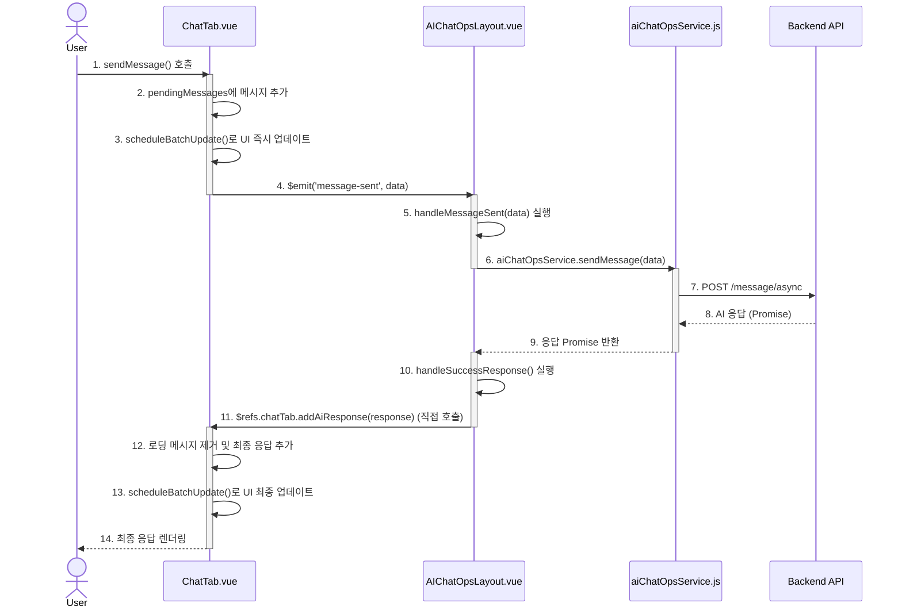

# AIChatOps 개발자 가이드 (수정본)

## 1. 소개

이 문서는 AIChatOps 프론트엔드 애플리케이션의 기술적 구조, 설계 원칙, 핵심 데이터 흐름을 설명하는 개발자용 가이드입니다. 신규 개발자의 온보딩과 코드 유지보수를 돕는 것을 목표로 합니다.

**기술 스택:**

- **프레임워크**: Vue.js 2
- **API 클라이언트**: Axios
- **UI 아이콘**: Lucide Icons (커스텀 컴포넌트)
- **스타일링**: CSS Variables

## 2. 시스템 아키텍처

```mermaid
graph TD
    subgraph Frontend Application
        subgraph Presentation Layer (Components)
            direction LR
            A[AIChatOpsLayout.vue] -- Props --> B[ChatTab.vue];
            A -- Props --> C[FeedbackTab.vue];
            B -- Events --> A;
            C -- Events --> A;
        end
        subgraph Service Layer
            D[aiChatOpsService.js]
        end
        subgraph Utility Layer
            E[i18n.js]
        end
    end

    A --> D;
    B --> D;
    C --> D;
    A --> E;
    B --> E;
    C --> E;

    D -- Axios --> F[Backend API];
```

- **Presentation Layer**: UI 렌더링과 사용자 상호작용을 담당하는 Vue 컴포넌트 계층입니다.
- **Service Layer**: `aiChatOpsService.js`가 백엔드 API와의 모든 통신을 추상화합니다.
- **Utility Layer**: `i18n.js`와 같이 애플리케이션 전반에서 사용되는 유틸리티 함수를 포함합니다.

## 3. 핵심 설계 원칙

### 3.1. 중앙 집중식 상태 관리 (Orchestrator Pattern)

최상위 컴포넌트인 `AIChatOpsLayout.vue`가 애플리케이션의 핵심 상태를 `data` 속성으로 소유하고, Props와 이벤트를 통해 하위 컴포넌트와 상호작용합니다. 이는 라이브러리 의존성을 줄이고 데이터 흐름을 명확하게 합니다.

### 3.2. 성능 최적화

- **조건부 렌더링**: 자주 전환되는 화면에는 `v-show`를, 메모리 사용량이 큰 컴포넌트에는 `v-if`를 사용하여 렌더링 성능을 최적화합니다.
- **UI 업데이트 배치 처리**: `Object.assign`과 `$nextTick`을 사용하여 여러 상태 변경을 하나의 DOM 업데이트로 묶어 처리함으로써, UI 깜빡임 현상을 방지합니다.
- **GPU 가속**: `transform: translateZ(0)`과 같은 CSS 속성을 사용하여 애니메이션 성능을 향상시킵니다.

## 4. 컴포넌트 상세

### 4.1. `AIChatOpsLayout.vue` (Orchestrator)

- **역할**: 애플리케이션의 모든 상태와 뷰 전환을 관리합니다.
- **주요 데이터**: `isOpen`, `currentView`, `selectedPersona`, `personas`, `personaMessageCache`.
- **주요 메소드**: `toggleChat`, `selectPersona`, `handleMessageSent`, `loadPersonas`, `saveCurrentMessages`, `loadCachedMessages`.

### 4.2. `ChatTab.vue` (Chat Interface)

- **역할**: 실제 대화 UI를 담당하며, 메시지 목록과 사용자 입력을 관리합니다.
- **Props**: `selectedPersona`, `isProcessing`.
- **주요 데이터**: `messages`, `currentMessage`, `pendingMessages`, `enhancedInputManager`.
- **주요 메소드**: `sendMessage`, `addAiResponse`, `scheduleBatchUpdate`, `loadPersonaHistory`, `adjustTextareaHeight`.

### 4.3. `aiChatOpsService.js` (Service Layer)

- **역할**: 백엔드 API와의 통신을 위한 단일 진입점입니다.
- **구현**: 모든 메소드는 `axios`를 사용하며, `try...catch`로 예외를 처리하고 일관된 응답 객체(`{ success, data, errorMessage }`)를 반환합니다.
- **주요 메소드**: `getPersonas`, `sendMessage`, `getConversations`, `generateQuickQuestions`, `htmlToPlainText`.

## 5. 데이터 흐름: 메시지 전송



## 6. 주요 개선 사항

- **메시지 전송 데이터 불일치 (치명적)**: `ChatTab.vue`에서 `sendMessage` 호출 시 `userQuery` 필드명을 사용하나, 서비스에서는 `userQuestion`을 기대하여 메시지가 전송되지 않는 버그가 있습니다. **`ChatTab.vue`에서 필드명을 `userQuestion`으로 즉시 수정해야 합니다.**
- **API 응답 처리 강화**: 옵셔널 체이닝(`?.`)을 사용하여 API 응답 구조 변경에 더 유연하게 대처해야 합니다.
- **상태 관리 분리**: 컴포넌트의 복잡도를 낮추기 위해 Vuex, Pinia 또는 Composable 함수를 도입하여 상태 관리 로직을 분리하는 것을 권장합니다.
- **컴포넌트 결합도 완화**: `$refs`를 통한 직접적인 메소드 호출 대신, 중앙 상태 관리를 통해 컴포넌트 간의 결합도를 낮추는 리팩토링이 필요합니다.
