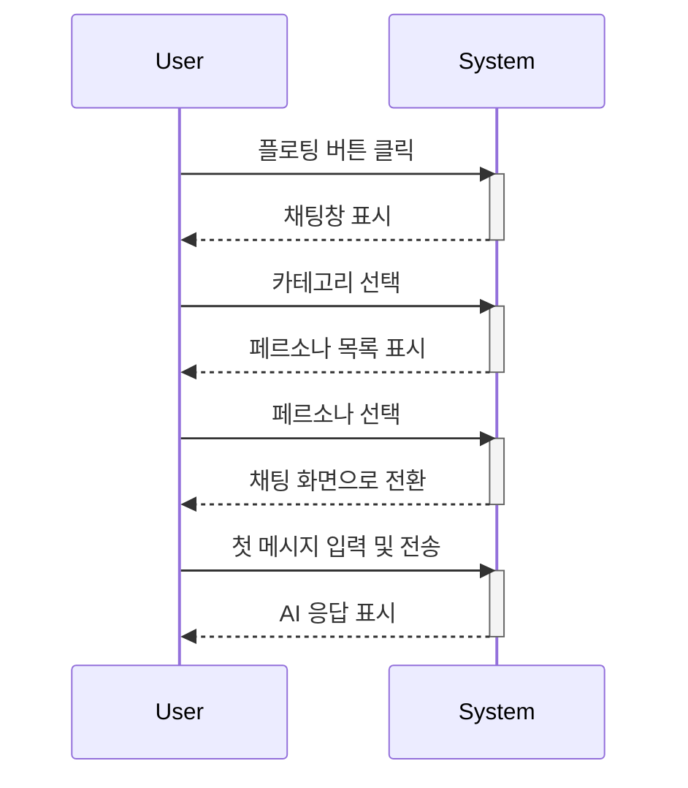

# AIChatOps 궁극의 사용자 가이드: 모든 것의 모든 것

## 1. AIChatOps란 무엇인가요?

AIChatOps는 단순한 챗봇이 아닙니다. 이는 특정 목적을 위해 세심하게 설계된 **지능형 AI 어시스턴트들의 집합체**입니다. 여러분은 '페르소나'로 불리는 각 분야의 AI 전문가와 연결되어, 마치 실제 전문가와 대화하듯 정교하고 전문적인 도움을 받을 수 있습니다.

이 문서는 AIChatOps의 모든 기능, 시각적 요소, 숨겨진 의미까지, 코드 한 줄 한 줄을 풀어서 설명하는 궁극의 가이드입니다.

## 2. AIChatOps의 세계관: 테마, 카테고리, 페르소나

본격적인 사용에 앞서, AIChatOps를 구성하는 세 가지 핵심 요소를 이해하면 더욱 풍부한 경험을 할 수 있습니다.

### 2.1. 감성을 담은 다섯 가지 테마

채팅창의 모습은 단순한 색상 조합이 아닌, 각각의 감성과 철학을 담고 있습니다. 헤더의 테마 변경 버튼(D, T, H, M, E)을 눌러 여러분의 감성에 맞는 테마를 선택해 보세요.

| 버튼 | 테마 이름 | 색상 코드 (주요/강조) | 감성 및 설명 |
| :--: | :--- | :--- | :--- |
| **D** | **Default (기본)** | `#2563EB` / `#06B6D4` | **신뢰와 안정감의 파란색.** 가장 표준적이고 깔끔한 테마입니다. 파란색이 주는 신뢰감과 청록색의 포인트는 전문적이면서도 현대적인 느낌을 주어, 어떤 작업에도 무난하게 어울립니다. |
| **T** | **Timeless (타임리스)** | `#000000` / `#C31B26` | **클래식한 우아함.** 오래된 책의 크림색 종이(`--timeless-primary: #FFFDD0`)와 잉크 같은 검은색, 그리고 진한 빨간색의 강조는 학술적이거나 전통적인 분위기를 자아냅니다. |
| **H** | **Heritage (헤리티지)** | `#1B2A47` / `#B8A081` | **역사와 전통의 무게감.** 짙은 네이비 색상과 가죽을 연상시키는 베이지 색상은 마치 유서 깊은 대학의 도서관에 온 듯한 느낌을 줍니다. 진중하고 깊이 있는 작업에 어울립니다. |
| **M** | **Modern (모던)** | `#0F403F` / `#BD9302` | **세련되고 도시적인 감각.** 짙은 숲 속 같은 녹색과 반짝이는 금색의 조화는 미니멀리즘과 럭셔리함을 동시에 표현합니다. 현대 미술관처럼 세련된 감각을 선사합니다. |
| **E** | **Hermes (헤르메스)** | `#FF7F00` / `#FFD700` | **활기차고 고급스러운 열정.** 명품 브랜드를 연상시키는 생동감 있는 주황색과 금색은 창의적이고 활기찬 에너지를 불어넣습니다. 역동적인 아이디어가 필요할 때 선택해 보세요. |

### 2.2. 당신의 목적지는 어디인가요? 세 가지 카테고리

AIChatOps는 여러분의 목적에 따라 세 가지 큰 길을 제시합니다. 이는 단순히 페르소나를 분류하는 것을 넘어, 여러분이 수행할 작업의 성격을 규정하는 첫 단계입니다.

- **개인 특화 (Personal)**
    - **의미**: 이 카테고리는 '나' 자신과 관련된 업무를 위한 공간입니다. 시스템이나 팀이 아닌, 사용자 개인의 일정, 할 일, 개인화된 데이터를 다루는 AI 전문가들이 여기에 속해 있습니다.
    - **언제 사용하나요?**: "오늘 내 스케줄 정리해줘", "내가 해야 할 업무 목록을 추천해줘" 와 같이 개인적인 비서가 필요할 때 선택하세요.

- **일반 문의 (General Support)**
    - **의미**: 회사나 서비스의 사용자라면 누구나 가질 수 있는 일반적인 질문을 해결하는 곳입니다. 고객 지원 센터의 '1차 창구'와 같은 역할을 합니다.
    - **언제 사용하나요?**: "이 시스템은 어떻게 사용하나요?", "최근 고객들의 주요 불만 사항은 뭐야?" 와 같이 일반적인 정보나 사용자 피드백이 궁금할 때 유용합니다.

- **운영/관리 (Operations)**
    - **의미**: 개발자, 시스템 관리자, 데이터 분석가 등 기술적인 깊이가 필요한 사용자를 위한 전문가 그룹입니다. 시스템의 내부 데이터, API 명세, 운영 현황 등 기술적인 주제를 다룹니다.
    - **언제 사용하나요?**: "프로젝트 현황 데이터를 분석해줘", "API 인증 방법을 알려줘" 와 같이 전문적인 기술 지원이나 데이터 분석이 필요할 때 선택하세요.

### 2.3. 누구와 대화하시겠어요? 전문가 페르소나

페르소나는 **'특정 분야의 지식과 말투를 학습한 AI 인격체'** 입니다. 각 페르소나는 저마다의 전문 분야를 가지고 있어, 여러분의 질문에 훨씬 더 정확하고 깊이 있는 답변을 제공합니다.

- **`personal_assistant` (개인 비서)**: 당신의 일정과 할 일을 관리합니다.
- **`user_support` (사용자 지원 전문가)**: 시스템 사용법과 자주 묻는 질문에 답합니다.
- **`voc` (고객의 소리 분석가)**: 고객 피드백과 이슈를 분석하고 요약합니다.
- **`swdp_menu` (SWDP 메뉴 전문가)**: 사내 시스템의 메뉴 구조를 안내합니다.
- **`project` (프로젝트 관리자)**: 프로젝트 현황, 팀원 정보 등을 알려줍니다.
- **`data_analyst` (데이터 분석가)**: 데이터를 분석하고 트렌드를 요약합니다.
- **`technical_expert` (기술 전문가)**: 기술 문서와 개발 가이드를 찾아줍니다.

## 3. 단계별 완벽 시나리오: AI와 첫 대화

이제 AIChatOps의 세계관을 이해했으니, 실제 대화 시나리오를 따라가 보겠습니다.

1.  **채팅창 열기**: 화면 우측 하단의 **플로팅 버튼**을 클릭하여 채팅창을 엽니다. 부드러운 애니메이션과 함께 채팅창이 나타나는 것을 확인하세요.

2.  **카테고리 선택**: "운영/관리"가 필요하다고 가정해 봅시다. **'운영/관리' 카드**를 클릭합니다. 이 카드는 시스템의 기술적인 부분을 다루는 전문가들을 만나러 가는 문입니다.

3.  **페르소나 선택**: "운영/관리" 카테고리 안의 페르소나 목록이 나타납니다. "프로젝트 현황이 궁금하니, **`project` (프로젝트 관리자)** 페르소나를 선택해야겠다"고 결정하고 카드를 클릭합니다.

4.  **대화 시작**: 채팅 화면으로 전환됩니다. 상단에는 '프로젝트 관리자'라는 이름이 표시되고, 중앙에는 "프로젝트 전문가, AIChatOps입니다!"라는 환영 메시지가 나타납니다. 이제 하단 입력창에 "현재 진행 중인 프로젝트 목록을 알려줘"라고 입력하고 `Enter` 키를 누릅니다.

5.  **AI의 응답**: 전송 버튼이 잠시 로딩 스피너로 바뀌고, "나는 이 답변을 해봤어요..!" 같은 재치 있는 로딩 메시지가 나타납니다. 잠시 후, AI가 프로젝트 목록을 깔끔하게 정리하여 답변해 줍니다.

## 4. 채팅 기능 200% 활용하기

### 4.1. 대화창의 비밀

- **AI 메시지**: 왼쪽의 회색 메시지 버블은 단순한 텍스트가 아닙니다. 자세히 보면 'Bot'이라는 작은 배지가 붙어있어, AI의 답변임을 명확히 합니다. 만약 답변에 표(Table)나 코드 블록이 포함되어 있다면, 이는 `customMarkdown.css`에 정의된 스타일 규칙에 따라 가독성 높게 렌더링됩니다.
- **메시지 복사**: AI 메시지 위로 마우스를 가져가면 나타나는 **복사 아이콘**은 단순 텍스트 복사가 아닙니다. 만약 내용이 표(Table)라면, `htmlToMarkdown` 함수가 호출되어 마크다운 형식으로 변환된 텍스트가 클립보드에 저장됩니다. 다른 곳에 붙여넣을 때 표 형식이 유지되도록 하는 세심한 배려입니다.

### 4.2. 입력창의 고급 기술

- **자동 높이 조절**: `enhancedInputManager` 객체가 여러분의 입력을 실시간으로 감지합니다. 입력 내용이 많아져 `lineCount`가 1을 초과하면, 입력창의 높이가 `minHeight(21px)`에서 `maxHeight(400px)`까지 부드럽게 늘어납니다. 높이가 `scrollThreshold(300px)`를 넘어서면, 더 이상 늘어나지 않고 내부 스크롤이 활성화되며, "↕️ 스크롤하여 전체 내용 확인"이라는 안내 메시지가 나타나 현재 상태를 알려줍니다.
- **연속 대화 (지능형 문맥 유지)**: 이 기능을 켜면, 여러분이 메시지를 보낼 때 `recentConversations` 배열에 저장된 최근 5개의 대화 쌍(질문과 답변)이 현재 질문과 함께 백엔드로 전송됩니다. AI는 이 과거 대화 기록을 바탕으로 문맥을 파악하여 답변하므로, "방금 말한 거"와 같은 대명사를 이해할 수 있게 됩니다.
- **전송 버튼의 상태 변화**: 이 버튼은 `canSendMessage`라는 계산된 속성(computed property)에 의해 제어됩니다. 즉, (1)입력창에 내용이 있고, (2)AI가 응답 중이 아니며, (3)페르소나가 선택된 상태여야만 활성화됩니다. 이 모든 조건이 충족될 때만 클릭할 수 있어, 사용자의 실수를 방지합니다.

## 5. 피드백: AIChatOps를 성장시키는 방법

여러분의 피드백은 단순한 의견이 아니라, AIChatOps의 학습 데이터가 됩니다.

- **작동 원리**: 여러분이 별점과 코멘트를 제출하면, `sendFeedback` 함수가 호출되어 `feedbackData` 객체를 API 서버로 전송합니다. 이 데이터는 서비스 개선의 중요한 지표로 활용됩니다.
- **결과 화면**: 피드백 제출이 성공하면, `showSuccess` 메소드가 호출되어 `resultType`을 'success'로 변경하고, 화면에 긍정적인 결과창을 표시합니다. 실패 시에는 `showError`가 호출되어 원인과 함께 재시도를 유도합니다. 이는 사용자에게 작업의 결과를 명확히 알려주는 중요한 UX 장치입니다.

이 가이드가 AIChatOps의 모든 잠재력을 끌어내는 데 도움이 되기를 바랍니다. 이제 여러분은 단순한 사용자를 넘어, AIChatOps의 모든 디테일을 이해하는 '파워 유저'입니다.